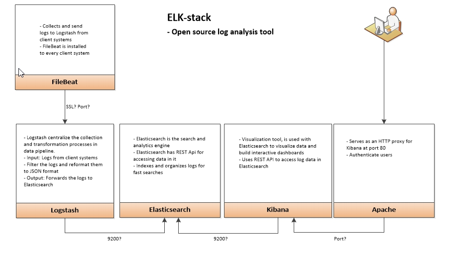
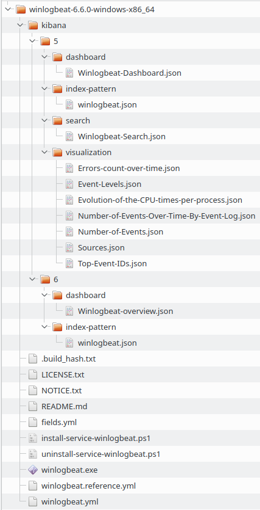

# Configuration
## Table of Contents

- [Schema](#schema)

- [Technical components](#technical-components)

- [Component configuration principles](#component-configuration-principles)

- [Network configuration](#network-configuration)

----------

- [Technical roadmap](#technical-roadmap)

    - [Task 1](#task-1), ELK server configuration (Salt Master, ELK stack)

    - [Task 2](#task-2), Automate Task 1

    - [Task 3](#task-3), Salt Minions: installation & connection to Salt Master

    - [Task 4](#task-4), Automate Task 3

    - [Task 5](#task-5), Salt Minions: write Salt state files

    - [Task 6](#task-6), Automate Task 5

    - [Task 7](#task-7), Improvements & troubleshooting

    - [Task 8](#task-8), Conclusions

----------

- [Issues/Discussion](#issuesdiscussion)

- [Notes](#notes)

- [Notes: About SaltStack state files](#notes-about-saltstack-state-files)

- [Useful links](#useful-links)

- [Issues](#issues)

- [TODO](#todo)


----------

## Schema

<details>
<summary>System layout</summary>

### Layout draw 1:



_Basic ELK stack system layout_

### Layout draw 2:


### Layout draw 3:

```
Log analysis system schema:                                                               Computer                   Network
                                         -----------------------------------│-----------------------------------│----------------│
                                                                            │                                   │                │
HTTP(S) Client (authorized)                                                 │ Computer, Mobile phone, Tablet... │ Remote network │
       │                                                                    │                                   │                │
       V                                 -----------------------------------│-----------------------------------│----------------│
       │  <authentication>                                                  │            WAN network            │                │
       │                                                                    │     Router (for NAT, FW etc.)?    │                │
       │                                                                    │       10.10.1.1 (default GW)      │                │
       │                                                                    │        NAT: 10.10.1.2:80          │                │
       V                                 -----------------------------------│-----------------------------------│                │
HTTP(S) Website (Apache, listen all IP addresses, port 80 + 443(?))         │                                   │                │
       │                                                                    │   Master (ELK server computer)    │                │
       │                                                                    │             10.10.1.2             │                │
     Apache                              -----------------------------------│-----------------------------------│                │ 
     (proxy server process, proxy for 127.0.0.1:5601)                       │                                   │                │
     (proxy server process, proxy for 10.10.1.30:80)                        │                                   │                │
^      │                                                                    │                                   │                │
│      ^                                                                    │                                   │                │
│ Kibana data                                                               │                                   │                │
│      │                                                                    │   Master (ELK server computer)    │                │
│      │                                                                    │             10.10.1.2             │                │
│      └── Kibana (local server process, listen on 127.0.0.1:5601)          │                                   │                │
│           │                                                               │                                   │                │
│           ^                            -----------------------------------│-----------------------------------│                │
│   Elasticsearch data (from 127.0.0.1:9200)                                │                                   │                │
│           │                                                               │                                   │                │
│           │                                                               │   Master (ELK server computer)    │                │
│           └── Elasticsearch (127.0.0.1:9200)                              │             10.10.1.2             │                │
│                 │                      -----------------------------------│-----------------------------------│ Local network  │
│                 ^                                                         │                                   │                │
│      JSON-parsed LogStash data (LogStash output, localhost:9200?)         │                                   │                │
│                 │                                                         │                                   │                │
│                 │                                                         │         LogStash computer         │                │
│                 └── LogStash (listen FileBeats ports)                     │        OR process on Master       │                │
│                       │                                                   │           (SSL priv key)          │                │
│                       │                                                   │             10.10.1.2             │                │
│                       ^                -----------------------------------│-----------------------------------│                │
│        Collected & pre-parsed log data (SSL check)                        │                                   │                │
│                       │                                                   │                                   │                │
│                       │                                                   │test_server-1 (SSL crt), 10.10.1.30│                │
└───10.10.1.30:80───────├── FileBeat <──── Raw log data ── Log process      │test_server-2 (SSL crt), 10.10.1.31│                │
                        │                                                   │                                   │                │
                        │                -----------------------------------│-----------------------------------│                │
                        │                                                   │                                   │                │
                        └── WinLogBeat <── Raw log data ── Log process      │test_server-3 (SSL crt), 10.10.1.60│                │
                                                                            │                                   │                │
                                         -----------------------------------│-----------------------------------│                │
```

**About SSL:**

_Since we are going to use Filebeat to ship logs from our Client Servers to our ELK Server, we need to create an SSL certificate and key pair. **The certificate is used by Filebeat to verify the identity of ELK Server.**_

- Ref: [DigitalOcean](https://www.digitalocean.com/community/tutorials/how-to-install-elasticsearch-logstash-and-kibana-elk-stack-on-ubuntu-14-04)

</details>

----------

## Technical components

Describes relevant software components which are being used in the project.

<details>
<summary>Details</summary>

**Master:** elkserver

**Minions:** all other computers on the local network

### SaltStack

| Component            | Configuration principle                                                                                         |
|----------------------|-----------------------------------------------------------------------------------------------------------------|
| Salt (Master)        | Has rules by which the minion computers should be configured on the local network                               |
| Salt (Minions)       | Retrieve and follow orders given by the local Salt master                                                      |

### SSH

| Component            | Configuration principle                                                                                           |
|----------------------|-------------------------------------------------------------------------------------------------------------------|
| SSH daemon (Master)  | SSH daemon which listens on the _remote_ network connections                                                      |
| SSH daemon (Minions) | SSH daemon which listens on the _local_ network connections; do not allow remote connections for security reasons |
| SSH client (Master)  | SSH client which has access to the local network SSH daemon processes for administration purposes                 |

Basic idea how to access minion computers from a remote network via master computer:

```
<remote_computer_with_SSH_client> ----login to master----> <SSH daemon (Master)> ----login to minions----> <SSH daemon (Minions)>
```

- SSH public key authentication requires `private key` on SSH daemon computer, and matching `public key` on allowed SSH client computers (works on Android phones/tablets, too)

### Other

| Computer       | Software Components                                                                                                                  |
|----------------|--------------------------------------------------------------------------------------------------------------------------------------|
| Router (?)     | IDS/IPS? (remember hardware/storage limitations! See [this](https://elatov.github.io/2015/08/running-snort-on-dd-wrt/), for instance |
| ELK server     | SaltStack (master role), HTTP daemon (Apache), SSH daemon + client, Kibana, Elasticsearch, LogStash                                  |
| test_server-1  | SaltStack (minion role), test_server-1, FileBeat, SSH daemon for local network (?), Apache, rsyslog                                  |
| test_server-2  | SaltStack (minion role), test_server-2, FileBeat, SSH daemon for local network (?), rsyslog, ...                                     |
| test_server-3  | SaltStack (minion role), test_server-3, WinLogBeat, SSH daemon for local network (?)                                                 |

----------

## Component configuration principles
# TODO

Describes software configuration principles which the project should follow.

----------

## Log data filtering principles

- Take GDPR into account

- Filter irrelevant log data

- Point out relevant & critical + abnormal data

----------

## Network configuration

Describes network links between computers used in the project.

| Computer      | Iface         | IPv4 address  | Subnet mask   | Network       | Gateway                          | Notes                                                                    |
|---------------|---------------|---------------|---------------|---------------|----------------------------------|--------------------------------------------------------------------------|
| Router        | eth0          | 10.10.1.1     | 255.255.255.0 | 10.10.1.0     | A) `<WAN IP`>                    | WAN IP if this PC acts as a router, disable DHCP                         |
|Master/ELK srvr| eth0          | 10.10.1.2     | 255.255.255.0 | 10.10.1.0     |                                  |                                                                          |
|               |               |               |               |               |                                  |                                                                          |
| test_server-1 | eth0          | 10.10.1.30    | 255.255.255.0 | 10.10.1.0     | 10.10.1.1                        | Internet access via Master? Does router act as a DNS resolver/forwarder? |
| test_server-2 | eth0          | 10.10.1.31    | 255.255.255.0 | 10.10.1.0     | 10.10.1.1                        | Internet access via Master? Does router act as a DNS resolver/forwarder? |
| test_server-3 | Win def Iface | 10.10.1.60    | 255.255.255.0 | 10.10.1.0     | 10.10.1.1                        | Internet access via router? Does router act as a DNS resolver/forwarder? |
|               |               |               |               |               |                                  |                                                                          |

### Useful commands

- Get network interface configuration: `ifconfig`

- Get current routing table: `route -4`, `route -6`, `ip route`

- Get current ARP cache info: `arp`

</details>

----------

## Technical roadmap

Describes steps which should be taken during the project.

### Task 1

<details>
<summary>Master (ELK server)/SaltStack configuration</summary>

#### Step 1-1)

**Required**

* [ ] Finished status

<details>
<summary>Master (ELK server) computer OS installation</summary>


- _Requirements: Virtual or physical machine (server PC, [Oracle VirtualBox](https://wiki.archlinux.org/index.php/VirtualBox), [QEMU](https://wiki.archlinux.org/index.php/QEMU), [VMWare](https://wiki.archlinux.org/index.php/VMware)...)_

- Installation ISO: [Ubuntu server 18.04 LTS](http://releases.ubuntu.com/bionic/ubuntu-18.04-live-server-amd64.iso) ([CLI-based](https://wiki.archlinux.org/index.php/Command-line_shell), no [WM](https://wiki.archlinux.org/index.php/window_manager)/[DE](https://wiki.archlinux.org/index.php/Desktop_environment))

</details>

----------

#### Step 1-2)

**Required**

- _Requirements: [Step 1](#Step-1) (Master computer)_

* [ ] Finished status

<details>
<summary>Master (ELK server): Prepare local SaltStack environment</summary>

* [ ] 1) SaltStack: Installation

    - **Packages:** `salt-master, salt-common, salt-ssh` (found in default repositories)

* [ ] 2) SaltStack: Initial configuration

    - **OS folders:** `/srv/salt`, `/srv/pillar`

    - **OS file:** `/etc/salt/master`

* [ ] 3) SaltStack: Basic testing

    - **Command:** `salt-local`

</details>

----------

#### Step 1-3)

**Recommended**

- _Requirements: [Step 2](#Step-2) (Master SaltStack environment)_

* [ ] Finished status

<details>
<summary>Master (ELK server)/SaltStack: hostname & default Admin account</summary>

- **SaltStack state file:** `/srv/pillar/.sls` (TODO)

    * [ ] Master: change system hostname 

        - **OS file:** `/etc/hostname`

            - Hostname: `elkserver`

    * [ ] Master: create sudo user (unless we use the one which is created during OS installation)

        - **Alternative A)** SaltStack built-in user creation method (_recommended_)

        - **Alternative B)** Basic command option:

            ```
            #!/bin/env/bash

            default_user=elastic
            default_pass=elasticsearch
            default_prettyname="Elastic Master admin"
            default_uid=1005

            useradd -r -G sudo -m -u $default_uid -U -s /bin/bash -c "${default_prettyname}" "${default_user}"
            printf ${default_user}:${default_pass} | chpasswd
            groupmod -g ${default_uid} ${default_user}
            ```
</details>

----------

#### Step 1-4)

**Required**

- _Requirements: [Step 2](#Step-2) (Master SaltStack environment)_

* [ ] Finished status

<details>
<summary>Master (ELK server)/SaltStack: Apache, SSH, LogStash, Elasticsearch, Kibana</summary>

* [ ] **1) Apache:** HTTP server daemon

    - **SaltStack state file:** `/srv/pillar/.sls` (TODO)

        - Basic installation (packages: `apache2`, `apache2-data`, `apache2-bin`, (`libapache2-mod-php`), found in default repositories)

        - Basic configuration

            - **OS file 1:** `/etc/apache2/apache2.conf` (on Ubuntu, other distros may use `/etc/httpd/conf/httpd.conf`)

                - Key contents:

                ```
                TraceEnable Off
                ServerSignature Off
                ServerTokens Prod
                ```

            - If Apache PHP module used, add the following into `/etc/apache2/mods-enabled/userdir.conf` (`UserDir disabled nobody`):

            ```
            <IfModule mod_userdir.c>
            UserDir public_html
            UserDir disabled root
            UserDir disabled nobody
            ...
            ```

            - See [GitHub/Fincer - Disable userdir module for user nobody to reduce server detection](https://github.com/Fincer/linux-server-setup/blob/master/exercises/h4.md#extra-disable-userdir-module-for-user-nobody-to-reduce-server-detection) for details.

            - **OS file 3:** `/etc/apache2/sites-available/01-kibana-proxy.conf` (requires command `a2ensite 01-kibana-proxy`)

                - Key contents (concept!):

                ```
                <VirtualHost *:80>

                    ServerAdmin webmaster@localhost
                    DocumentRoot <kibana site root>

                    <Directory "<kibana site root>">
                        ProxyPreserveHost On

                        ProxyPass /kibana http://127.0.0.1:5601
                        ProxyPassReverse /kibana http://127.0.0.1:5601
                    </Directory>

                    ErrorLog ${APACHE_LOG_DIR}/error.log
                    CustomLog ${APACHE_LOG_DIR}/access.log combined

                </VirtualHost>
                ```

                - **NOTE:** Do not forget commands `a2enmod proxy` and `a2enmod proxy_http` in order to enable proxy on Apache.

                - Additionally, consider HTTP headers fine-tuning, see [GitHub/Fincer - Additional protection by fine-tuning Apache HTTP headers](https://github.com/Fincer/linux-server-setup/blob/master/exercises/h4.md#extra-additional-protection-by-fine-tuning-apache-http-headers) for details.

        - Basic testing

* [ ] **2) SSH:** Encrypted remote access to master

    - **SaltStack state file:** `/srv/pillar/.sls` (TODO)

        - Basic installation (packages: `openssh-server`, `openssh-client`, found in default repositories)

        - Basic configuration

            - **OS file 1:** `/etc/ssh/sshd_config`

                - Key contents (see also [Gentoo Linux dev: Hardening OpenSSH](https://dev.gentoo.org/~swift/docs/security_benchmarks/openssh.html)):

                    - `PermitRootLogin <yes, no>` (Allow/Deny root login)

                    - `IgnoreRhosts <yes, no>`

                    - `Banner "<none, [string value]>"` (SSH login [MOTD](https://en.wikipedia.org/wiki/Motd_(Unix)) banner message)

                    - `MaxAuthTries <value>` (Maximum SSH login attempts)

                    - `MaxSessions <value>` (Maximum simultaneous SSH sessions)

                    - `Port <value>` (SSH TCP port)

                    - `ClientAliveInterval <value, sedonds>` (Maximum idle time for a client until we disconnect)

                    - `ClientAliveCountMax <value>` (Maximum _alive_ connection attempts between SSH daemon & client)

                    - `PubkeyAuthentication <yes, no>` (Use asymmetric public key authentication?)

                    - `PasswordAuthentication <yes, no>` (Use password authentication)

                    - `PermitEmptyPasswords <yes, no>` (Allow/Do not allow empty passwords?)

                    - `AuthenticationMethods <publickey,password|publickey|password>`

                        - `publickey,password` = Two-way authentication. At first, check whether a client is allowed to connect (public key authentication) at all after which, if access is allowed, ask login password (password authentication) for SSH user. Recommended.

                        - `publickey` = Public key authentication only. Check whether a SSH client is allowed to connect. If supplied SSH login name is correct and access is allowed for this client, let the user in.

                            - Limits access to the system for specific computers (SSH clients) only. No password check.

                        - `password` = Password authentication only. Check only supplied SSH login name and password.

                            - Grants access to the system for all computers with a SSH client if login credentials are OK. No key check.

        - Basic testing

* [ ] **4) [LogStash](https://github.com/elastic/logstash):** Tool for managing events and logs

    - **SaltStack state file:** `/srv/pillar/.sls` (TODO)

        - Basic installation (package: `https://artifacts.elastic.co/downloads/logstash/logstash-6.6.0.deb` + Oracle Java 8, see ElasticSearch section above)

            - **NOTE:** Creates user & group `logstash` with the following info (`/etc/passwd`):
`logstash:x:999:999:LogStash Service User:/usr/share/logstash:/usr/sbin/nologin`

        - Basic configuration

            - **OS file 1:** `/etc/logstash/startup.options`

            - **OS files, other:** `/etc/logstash/conf.d/*.conf` (see [this](https://www.digitalocean.com/community/tutorials/how-to-install-elasticsearch-logstash-and-kibana-elk-stack-on-ubuntu-14-04#configure-logstash) and [this](https://www.elastic.co/guide/en/logstash/current/configuration-file-structure.html) for details, etc.)

        - Basic testing

* [ ] **5) [Elasticsearch](https://github.com/elastic/elasticsearch):** Distributed RESTful search engine built on top of Lucene

    - **SaltStack state file:** `/srv/pillar/.sls` (TODO)

        - Basic installation (package: `apt-add-repository -y ppa:webupd8team/java && apt update && apt install -y oracle-java8-installer` + `https://artifacts.elastic.co/downloads/elasticsearch/elasticsearch-6.6.0.deb`) (does not support openjdk, and Oracle Java 8 is recommended by elastic). **TODO:** automatically accept license terms when installing `oracle-java8-installer`

        - Basic configuration

            - **OS file 1:** `/etc/elasticsearch/elasticsearch.yml` (for configuring Elasticsearch)

                - Key contents:

                ```
                network.host: <ipv4-address> (127.0.0.1?)
                http.port: 9200
                path.logs: /var/log/elasticsearch
                discovery.zen.ping.unicast.hosts: ["<host-1>", "<host-2>"]
                ```

            - **OS file 2:** `/etc/elasticsearch/log4j2.properties` (for configuring Elasticsearch logging)

            - **OS file 3:** `/etc/elasticsearch/jvm.options` (for configuring Elasticsearch JVM settings)

            - **Other files (not relevant?):** `/etc/elasticsearch/roles.yml`, `/etc/elasticsearch/role_mapping.yml` (For LDAP)

        - Basic testing

        - **NOTE:** See [Elastic.co - Configuring Elasticsearch](https://www.elastic.co/guide/en/elasticsearch/reference/current/settings.html) for further information

        - **NOTE:** Package installation creates `elasticsearch` group and user (UID/GID 112/115) by default. This user has the following info (`/etc/passwd`): `elasticsearch:x:112:115::/nonexistent:/bin/false` (no extra hardening required)

* [ ] **6) [Kibana](https://github.com/elastic/kibana):** Browser based analytics and search dashboard for Elasticsearch

    - **SaltStack state file:** `/srv/pillar/.sls` (TODO)

        - Basic installation (package: `https://artifacts.elastic.co/downloads/kibana/kibana-6.6.0-amd64.deb`)

        - Basic configuration

            - OS file 1: `/etc/kibana/kibana.yml`

                - Key contents: [Elastic.co - Kibana Configuration Settings](https://www.elastic.co/guide/en/kibana/current/settings.html)

                    ```
                    server.host: "localhost"
                    server.port: 5601
                    elasticsearch.hosts: "http://localhost:9200"
                    status.allowAnonymous: <false,true>
                    ```

                - Other: Enable Kibana SSL settings (see above link for conf)? Please note that Kibana listens only to localhost!

                - Useful links:

                    - [Kibana 5.4 behind Nginx](https://discuss.elastic.co/t/kibana-5-4-behind-nginx/98114)

        - Basic testing

</details>

----------

#### Step 1-5)

**Recommended**

- _Requirements: [Step 2](#Step-2) (Master SaltStack environment)_

* [ ] Finished status

<details>
<summary>Master (ELK server)/SaltStack: Basic filesystem hardening (root access)</summary>

- **SaltStack state file:** `/srv/pillar/.sls` (TODO)

    * [ ] Lock root

        - **Command:** `usermod --lock root` (lock root)

        - **Command:** `usermod -u 0 -s /usr/sbin/nologin` (no root login shell)

        - **Command:** `sed -iE 's/^(tty[0-9]*)$/#\1/' /etc/securetty` (Comment virtual terminal lines in `etc/securetty` file)

</details>

----------

#### Step 1-6)

**Recommended**

- _Requirements: [Step 2](#Step-2) (Master SaltStack environment)_

* [ ] Finished status

<details>
<summary>Master (ELK server)/SaltStack: Basic network rules</summary>

- **SaltStack state file:** `/srv/pillar/.sls`

   * [ ] **1)** Firewall: configure [iptables](https://en.wikipedia.org/wiki/Iptables) or UFW

       - **Alternative A):** iptables

           - **OS file 1:** `/etc/iptables/iptables.rules`

               - Sample file contents: [GitHub - Fincer/linux-server-setup - iptables.rules](https://github.com/Fincer/linux-server-setup/blob/master/other/iptables.rules)

       - **Alternative B)** [UFW](https://wiki.archlinux.org/index.php/Uncomplicated_Firewall)

            - Use SaltStack mechanisms. For required basic commands, see [GitHub - Fincer/linux-server-setup (Firewall)](https://github.com/Fincer/linux-server-setup/blob/master/exercises/h5.md#b-establish-a-firewall-protection-to-the-server-computer-note-allow-ssh-traffic-before-that)

   * [ ] **2)** [sysctl: set networking and Linux kernel rules](https://en.wikipedia.org/wiki/Sysctl)

       - **OS file:** `/etc/sysctl.conf` (alternatively `/etc/sysctl.d/*.conf`) after which `sysctl -p` must be run as root (to update the ruleset)

       - Conf file configuration options:

           - Respond to/Ignore ICMP echo requests/replies:

                ```
                net.ipv4.icmp_echo_ignore_all = <0,1>
                ```

           - Allow/Deny all ICMP redirects (recude MITM attack possibility):

                ```
                net.ipv4.conf.all.accept_redirects = <0,1>
                net.ipv6.conf.all.accept_redirects = <0,1>
                ```

           - Send/Don't send ICMP redirects (are we a router?):

                ```
                net.ipv4.conf.all.send_redirects = <0,1>
                ```

           - Allow/Deny secure ICMP redirects (Reject ICMP redirects for gateways listed in our default gateway list (enabled by default)):

                ```
                net.ipv4.conf.all.secure_redirects = <0,1>
                ```

           - Enable/Disable IPv4 packet forwarding:

                ```
                net.ipv4.ip_forward = <0,1>
                ```

           - Set/Unset IPv4 RP filter (spoof protection):

                ```
                net.ipv4.conf.default.rp_filter = <0,1>
                net.ipv4.conf.all.rp_filter = <0,1>
                ```
</details>

----------

#### Step 1-7)

**Recommended**

- _Requirements: [Step 2](#Step-2) (Master SaltStack environment)_

* [ ] Finished status

<details>
<summary>Master (ELK server)/SaltStack - Network interface names</summary>

- [Network interface names: use easily distinguisable old names (i.e. `eth0`), or new names (i.e. `enp0s3`)?](https://www.itechlounge.net/2016/04/linux-how-to-rename-the-network-interface-in-centosrhel7/)

- **SaltStack state file:** `/srv/pillar/.sls`

    - **Alternative A)** Command: `sed -iE 's/^(GRUB_CMDLINE_LINUX="*)"$/\1net.ifnames=0 biosdevname=0"/' /etc/default/grub && grub-mkconfig -o /boot/grub/grub.cfg`

    - **Alternative B)** Add `/etc/default/grub` configuration file into SaltStack folder hierarchy and add `net.ifnames=0 biosdevname=0` into parameters of `GRUB_CMDLINE_LINUX` option. After that, run either command `grub-mkconfig -o /boot/grub/grub.cfg` directly or its command alias `update-grub` as root (sudo)

        - **Explanation:** Adds `net.ifnames=0` and `biosdevname=0` [Linux kernel parameters](https://wiki.archlinux.org/index.php/Kernel_parameters) into computer [Grub2](https://wiki.archlinux.org/index.php/GRUB) bootloader configuration

</details>

----------

#### Step 1-8)

**Required**

- _Requirements: [Step 2](#Step-2) (Master SaltStack environment), [Step 7](#Step-7) (NIC naming policy), working network interface configurations_

* [ ] Finished status

<details>
<summary>Master (ELK server)/SaltStack: Configure static IPv4</summary>

- **Alternative A)** Set static IP address to this host in host configuration.

- **1)** Use roughly the following commands to obtain necessary Iface information:

    ```
    # Enabled (UP) network interfaces:
    ip addr show | grep "UP" | grep -v "lo:" | awk '{print $2}' | sed 's/\://'

    # Interface IPv4 address (inet), subnet mask (netmask), broadcast address:
    ifconfig <interface> | grep "inet " | sed 's/^\s*//'

    # Default DNS nameservers (obtained via DNS resolver):
    grep -vE "^$|#" /etc/resolv.conf | sed 's/^[a-z]* //'

    # Gateway for interface
    ip route | grep -E "^[^0-9]" | grep <interface> | awk '{print $3}'
    ```

- **2)** Put above information into `/etc/network/interfaces` file (available on Ubuntu Server, not available on all Linux distributions). Sample contents of the `interfaces` file:

    ```
    # The loopback network interface
    auto lo
    iface lo inet loopback

    # The primary network interface
    auto <interface>
    iface <interface> inet static
    address <interface IPv4 address>
    netmask <interface subnet mask (syntax: 255.255.255.0)>
    network <interface subnet (i.e. 192.168.0.0)>
    broadcast <interface broadcast address>
    gateway <interface gateway>
    dns-nameservers <dns nameservers>
    ```

- **3)** To apply NIC configuration changes immediately, run the following commands:

    ```
    ip link set <interface> down
    ip addr flush dev <interface>
    ip addr add <interface IPv4 address>/<interface subnet mask in short format> dev <interface>
    ip link set <interface> up
    ```

- **Alternative B)** Set up a separate DHCP server (either another host on the same network or a router device) which defines a _static IP address_ for this host (known as _DHCP Static Lease_). On Linux, use `dhcpd` DHCP server daemon, and set the following configuration (roughly) for its configuration file `/etc/dhcpd.conf`:

    - [GitHub - Fincer/snic/dhcpd.conf (eth0)](https://github.com/Fincer/snic/blob/master/snic/dhcpd4-eth0.conf)

    - Client side: Computers on the network must run a DHCP client daemon on the selected network interface, either `dhcpcd` or `dhclient` (the latter is the default daemon on Ubuntu), in order to obtain a IPv4 address from DHCP server daemon. Windows clients use `DHCP Client service`

</details>

</details>

----------

### Task 2

<details>
<summary>Automate Task 1</summary>

* [ ] Automatic configuration shell script (Bash, `.sh`) for stuff done in [Task 1](#Task-1)

</details>

----------

### Task 3

<details>
<summary>Salt Minions: installation & connection to Salt Master</summary>

- SaltStack minions: installation & connection to Salt Master

    - Linux minions

        - Linux Salt Minion installation (Ubuntu 18.04, `.deb`)

        - Connection to local network Salt Master

    - Windows minions

        - Windows Salt Minion installation

        - Connection to local network Salt Master

</details>

----------

### Task 4

<details>
<summary>Automate Task 3</summary>

* [ ] Automatic configuration shell script (Bash, `.sh`) for stuff done in [Task 3](#Task%201)

</details>

----------

### Task 5

<details>
<summary>Salt Minions: write Salt state files</summary>

* [ ] SaltStack minions, state file configurations

    * [ ] **test_server-1**

        - OS: Ubuntu 18.04 LTS (Server)

            - Installation ISO: [Ubuntu server 18.04 LTS](http://releases.ubuntu.com/bionic/ubuntu-18.04-live-server-amd64.iso) ([CLI-based](https://wiki.archlinux.org/index.php/Command-line_shell), no [WM](https://wiki.archlinux.org/index.php/window_manager)/[DE](https://wiki.archlinux.org/index.php/Desktop_environment))

            - Define Hostname (& Salt user?, default is root)

            - Set fixed IPv4 for eth0

            - Filebeat

                - Connection to local network LogStash computer

            - Logging proposals:

                - rsyslog

                - Apache2

    * [ ] **test_server-2**

        - OS: Ubuntu 18.04 LTS (Server)

            - Installation ISO: [Ubuntu server 18.04 LTS](http://releases.ubuntu.com/bionic/ubuntu-18.04-live-server-amd64.iso) ([CLI-based](https://wiki.archlinux.org/index.php/Command-line_shell), no [WM](https://wiki.archlinux.org/index.php/window_manager)/[DE](https://wiki.archlinux.org/index.php/Desktop_environment))

            - Define Hostname (& Salt user?, default is root)

            - Set fixed IPv4 for eth0

            - Filebeat

                - Connection to local network LogStash computer

            - Logging proposals:

                - rsyslog

                - random process log?

    * [ ] **test_server-3**

        - Windows 2016 server?

            - Define Hostname (& Salt user?, default is ADMIN or SYSTEM)

            - Set fixed IPv4 for default NIC (Get active NICs & their info with PowerShell cmd: `Get-WmiObject -Class win32_networkadapter -Filter "netconnectionstatus = 2" | Get-NetIPConfiguration`)

                - PowerShell commands are possible to execute using built-in SaltStack methods. See [Stackoverflow: saltstack: run powershell script in a state](https://stackoverflow.com/questions/45361995/saltstack-run-powershell-script-in-a-state), for instance.

            - WinLogBeat ([Direct download link](https://artifacts.elastic.co/downloads/beats/winlogbeat/winlogbeat-6.6.0-windows-x86_64.zip))

                - Connection to local network LogStash computer

            - Logging proposals:

                - Event Log

- Other server computers salt minion connection to master computer (for administration)

</details>

----------

### Task 6

<details>
<summary>Automate Task 5</summary>

* [ ] Automatic configuration shell script (Bash, `.sh`) for stuff done in [Task 5](#Task%201)

</details>

----------

### Task 7

<details>
<summary>Improvements & troubleshooting</summary>

* [ ] System configuration testing & troubleshooting & improvements

</details>

----------

### Task 8

<details>
<summary>Conclusions</summary>

- Conclusions

</details>

----------

## Issues/Discussion

<details>
<summary>Details</summary>

### Local subnet & interfaces

- Create a local subnet for all computers which are related somehow to ELK stack configuration. Route ELK server HTTP/HTTPS (Apache) traffic to router, use NAT in router. Consider IDS/IPS here.

    - Either add a individual router or make ELK server act as a router (requires 2 NICs (network interfaces) for that. 1 NIC is for internal network traffic (network: 10.10.1.0) and another one is for external connections. To set network interface act in router mode on Linux, see [GitHub - Fincer/snic](https://www.github.com/Fincer/snic))

    - Benefits: hardware requirements for Intrusion Detection/Prevention system does not exceed the hardware limits (which is an issue with common routers)

    - Requires IPv4 packet forwarding in `sysctl` (Linux kernel) and in `iptables` (Firewall) between these 2 NICs on ELK server.

</details>

----------

## Notes

<details>
<summary>Details</summary>

- Salt Master & Salt minion versions must match on various computers. Otherwise, conflicts are likely to occur

- Software installation on Windows minions can be troublesome, see [GitHub - Fincer, Salt minion state file (Windows)](https://github.com/Fincer/salt_gisworkstation/blob/master/srv_salt/gis_windows/init.sls), lines 80-86:

```
# Installation of Windows programs with Salt is not as good as on Linux minions
# Many installation processes seem not to report about their statuses back to the
# Salt minion process, thus making Salt master to think that the minion
# computer doesn't return anything. Therefore, some custom approaches
# for installing Windows software on Salt minion must be taken for now
```

- As a result, Windows Salt minion may return failure even if the Salt run is succeeded. For instance, see [this picture](https://raw.githubusercontent.com/Fincer/salt_gisworkstation/master/sample_images/screen_ubuntu-master-final.png)

</details>

----------

## Notes: About SaltStack state files

<details>
<summary>Details</summary>

- Salt state file structure & hierarchy (`/srv/{salt,pillar}`) can and will be changed when the project progresses. This is expected! These changes may include

    - adding pre-defined configuration files

    - adding Salt pillar variables for different Salt minions

    - Splitting sls files into multiple ones, depending on the need

</details>

----------

## Useful links

- [Elastic.co: Should Logstash and ES be in different machines in production?](https://discuss.elastic.co/t/should-logstash-and-es-be-in-different-machines-in-production/42251)

- [Elastic.co: Configuring Filebeat](https://www.elastic.co/guide/en/beats/filebeat/current/configuring-howto-filebeat.html)

- [DigitalOcean: How To Install Elasticsearch, Logstash, and Kibana (ELK Stack) on Ubuntu 14.04](https://www.digitalocean.com/community/tutorials/how-to-install-elasticsearch-logstash-and-kibana-elk-stack-on-ubuntu-14-04)

----------

## Issues

<details>
<summary>Details</summary>

### Issue: Winlogbeat installation & uninstallation on Windows minion

- Archive: [Elastic.co: Winlogbeat 6.6.0 x86_64.zip](https://artifacts.elastic.co/downloads/beats/winlogbeat/winlogbeat-6.6.0-windows-x86_64.zip)

- Downloaded archive layout:



- SaltStack SLS installation file: [winlogbeat.sls](data/salt-master/srv/salt/win/repo-ng/winlogbeat.sls)

    - Issue: normally, we define a single installer executable in SLS file. However, archive layout does not directly support this traditional approach.

</details>

----------

## TODO

<details>
<summary>Details</summary>

- Decide roles and processes of test_server-1, test_server-2, test_server-3 (which logs do we collect?)

- Do test_servers have access to internet? Proposal: create a publicly accessible website for test_server-1

- Decide whether LogStash process runs on ELK server or on an individual computer (affects SaltStack & network configuration). Proposal: run on the ELK server to avoid complexity in configuration (yes, we can set up another computer for this, too)

- Apache Web authentication for Kibana front-end. Practical suggestions?

- Suggestion: install & configure `fail2ban` and/or `snort` for the network (IDS/IPS). Router would be the best option for this as it is in central/key role in our network setup. Another option would be ELK server but how we treat test servers in our network then? Router would be good option, although hardware resources are likely not enough. We can set up a separate linux router computer to circumvent that limitation, however.

- Define & update SaltStack state file names (sls) & paths here, and in actual file paths

- Write & test SaltStack sls state files

    - Common conf: `/srv/salt/ ...` ([link](data/salt-master/srv/pillar/))

    - Computer-specific conf: `/srv/pillar ...` ([link](data/salt-master/srv/salt/))

- Write Bash shell & Windows PowerShell initialization scripts ([link](scripts/))

- Auto-accept Oracle Java 8 license terms on Salt Master (ELK server) while installing Elasticsearch & LogStash (see [Task 1 - Step 1-4](#step-1-4))

- Solve [issues](#issues) above

</details>
